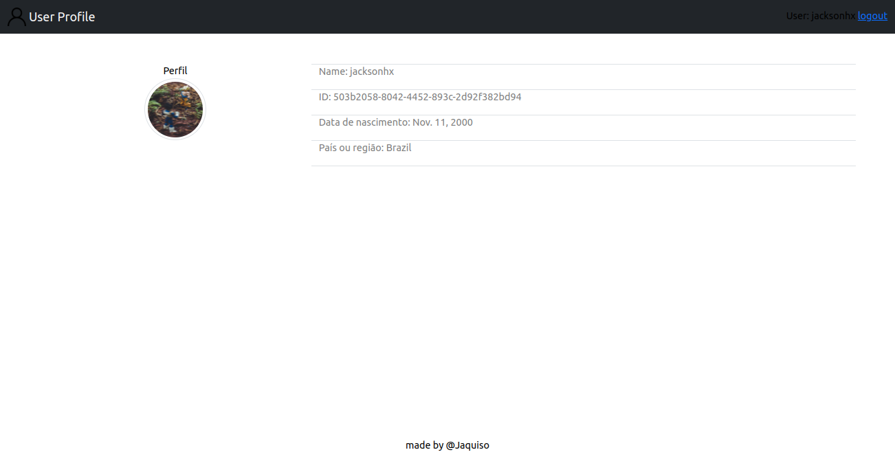
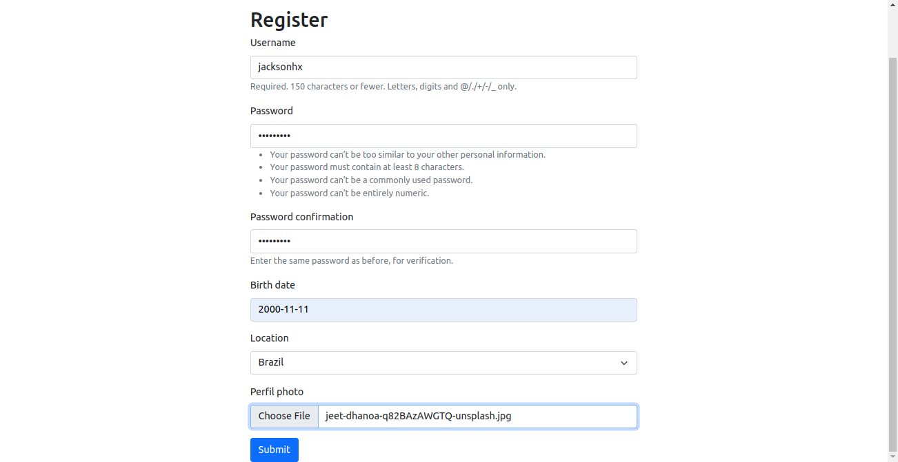
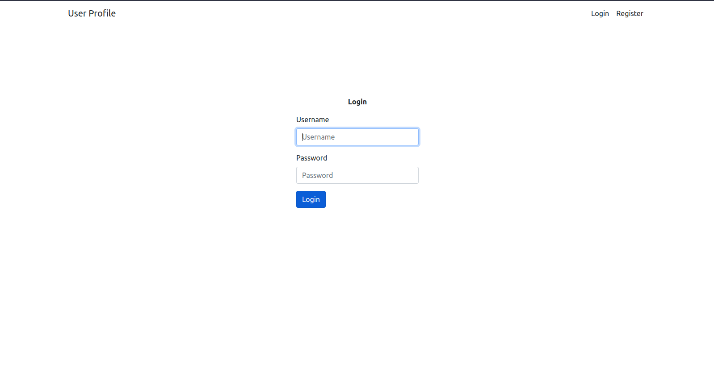

# User Profile

App that lets you create a user with a profile picture

### Screenshots




### Learnings

I learned more about the Django authentication system , security and manipulate statics and media files with Django.

```python
# Base url to serve static files
STATIC_URL = 'static/' 
# Path where static is stored
STATIC_ROOT = os.path.join(BASE_DIR,'static/')

# Base url to serve media files
MEDIA_URL = 'media/'
# Path where media is stored
MEDIA_ROOT = os.path.join(BASE_DIR, 'media/')

```
```python
class User(AbstractUser):
    id = models.UUIDField(
        primary_key=True,
        default=uuid.uuid4,
        unique=True,
        editable=False,
        null=False, 
        blank=False,
        )
```

### Tools used
- Django
- Bootstrap5
- HTML/CSS

### Clone e run this project with

```
git clone https://github.com/Jackson-Vieira/UserProfile-Project
cd UserProfile-Project
pip install requirements.txt # or activate the virtualenv
python3 manage.py migrate
python3 manage.py runserver
```